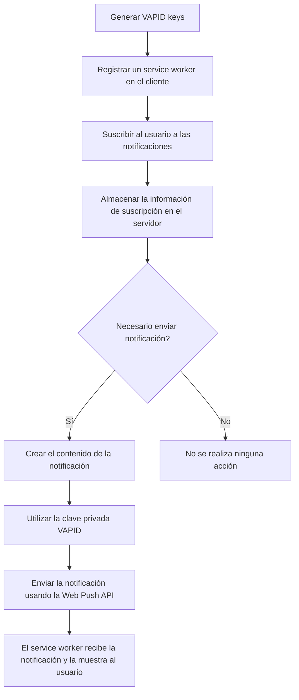

# Web Push API Example 🚀

This is just an example implementation for web push notifications using the Web Push API.

```mermaid
graph TD;
  A[Generar VAPID keys] --> B[Registrar un service worker en el cliente];
  B --> C[Suscribir al usuario a las notificaciones];
  C --> D[Almacenar la información de suscripción en el servidor];
  D --> E{Necesario enviar notificación?};
  E -->|Sí| F[Crear el contenido de la notificación];
  F --> G[Utilizar la clave privada VAPID];
  G --> H[Enviar la notificación usando la Web Push API];
  H --> I[El service worker recibe la notificación y la muestra al usuario];
  E -->|No| Z[No se realiza ninguna acción];

```